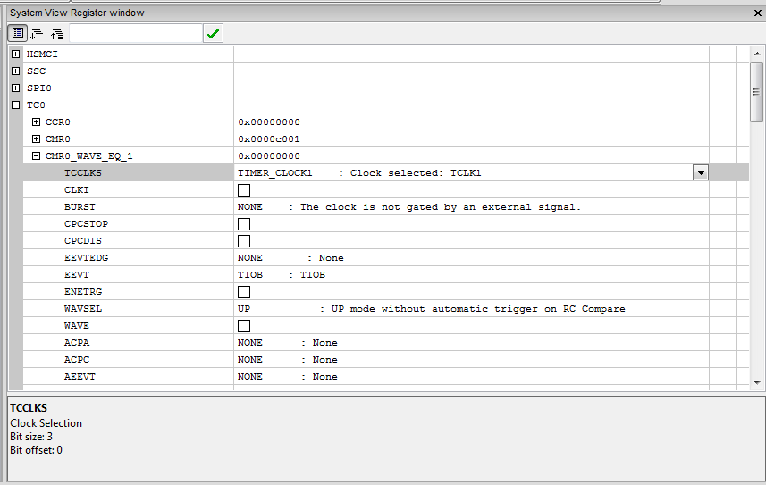
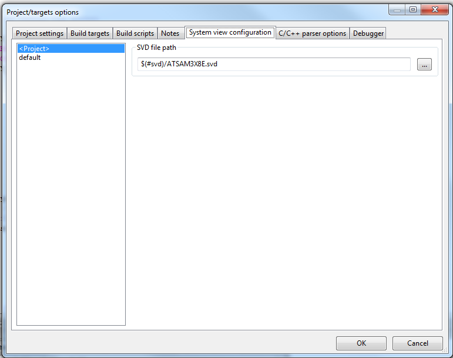
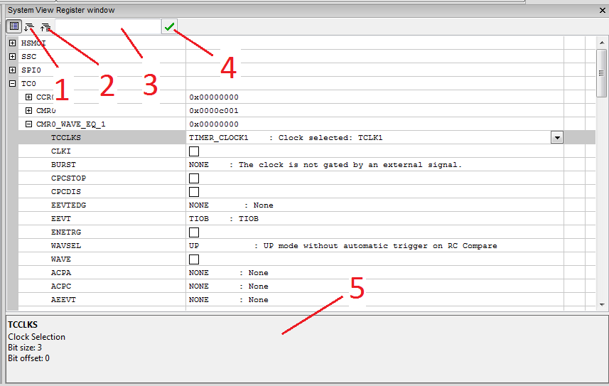
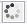

Table of Contents
=================

   * [cbSystemView](#cbsystemview)
      * [Screen shots](#screen-shots)
      * [Getting Started](#getting-started)
         * [Prerequisites](#prerequisites)
         * [Installing](#installing)
      * [Using the plugin](#using-the-plugin)
         * [Prerequisites](#prerequisites-1)
         * [Set up the project](#set-up-the-project)
         * [User interface](#user-interface)
         * [Debugging and writing register](#debugging-and-writing-register)
      * [Contributing](#contributing)
      * [Changelog](#changelog)
      * [Authors](#authors)
      * [License](#license)
      * [Acknowledgments](#acknowledgments)


# cbSystemView

Embedded system register viewer plugin for [Code::Blocks IDE](http://www.codeblocks.org/). 


This plugin allows to view and edit the system register of ARM controller. The register definition are read from [SVD](https://www.keil.com/pack/doc/CMSIS/SVD/html/index.html)-Files and displayed in a property grid. This plugin uses the gdb-plugin shiped with codeblocks

## Screen shots
The register TC0 from a ATSAM3X8E from atmel on windows 7



The project settings dialog to set the SVD file path (global variables are usable) on windows 7. Every target can have his own SVD File, or a global file can be specified.


## Getting Started

At the moment there are no binary builds available for this plugin so you have to build it by yourself.

### Prerequisites

The needed plugin API is currently not merged in Code::Blocks. You need to use [this branch of Code::Blocks](https://github.com/bluehazzard/codeblocks_sf/tree/debugger/pull_candidate/memory_range_watch/1) and build codeblocks by yourself. 
An instruction to build Code::Blocks can be found [here](http://wiki.codeblocks.org/index.php/Installing_Code::Blocks)

A installed and running wxWidgets library with version 3.X.X (you need this also for building Code::Blocks)

To get the code for this plugin you can clone the git repo or download the code as zip archive.

The folder structure is as following:
* Code::Blocks source code cloned to 
```
/home/test/programming/codeblocks_source/
```
In this folder there should be a folder called *src*, *m4* and *debian*. The Code::Blocks source code should be found under *src*
* cbSystemView source code:
```
/home/test/programming/cbSystemView_source/
```
In this folder you find the .cbp files of the plugin and this README.md file

### Installing

0. Build a Code::Blocks version with wxWidgets version 3.X.X

1. To build the plugin simply open the project file corresponding for your operating system:
 * windows: cbSystemView.cbp
 * linux: cbSystemView_unix.cbp
 * mac: Sorry, i don't have a mac to provide any project file... Help is welcome...
2. Configure the *cb* global variable to point to the *src* folder of your codeblocks repository
```
/home/test/programming/codeblocks_source/src
```
You can configure the global variable under:
  * Settings->Global variables
  * Select cb on the left list
  * Set the path in the *base* field

3. select the *cb_plugin_wx30* target from the drop down menu near the build button
4. Hit the build button
5. Fix errors (there should not be any errors ;) )
6. Open your productive codeblocks program
7. Plugins->Manage plugins->Install new
8. Browse to 
```
/home/test/programming/cbSystemView_source/plugin_wx30
```
and select the plugin to install.

  **!!NOTE**: The plugin can only run in a Code::Blocks version compiled with the same compiler and the same wxWidgets version.


## Using the plugin

### Prerequisites
* To use the plugin you need a running gdb debugger environment for your embedded system. So if you hit *debug* on your project all should work fine and you should can set breakpoints and read variables from the micro controller.
* The debugger has to support random memory access
* The device has to support readout of the system registers from the debugger over the RAM
* You need a SVD file for your controller. SVD Files for all major vendors can be found [here](https://github.com/posborne/cmsis-svd) (in the *data* folder).
### Set up the project
First select your SVD file for the target/project:
1. Project->Properties->System view configuration (**Note**: you maybe have to hit the *>* button on the top right to scroll trough the taps)
2. Select the target from the list on the left or *<Project>* if you want to use the same SVD file for the whole project
3. Enter the path to the SVD file in *SVF file path* or hit the *...* button. Select he SVD file for your controller. If you have all SVD Files stored in one central place [global variables](http://wiki.codeblocks.org/index.php/Global_compiler_variables) could be of good use

### User interface
The main window of this plugin is displayed below

1. Expand: Expand all registers and nodes
2. Collapse: Collapse all registers and nodes
3. Search: enter text to search for registers and flags (no regex, searches for any match) The search starts with a small delay and can take some time (limitation of the property grid). The registers are only hidden and still updated in the background.
4. Update indicator
5. General register/field/flag description 

### Debugging and writing register
If the project is set up you can run the debugger with the red arrow. Open the register view with *System View->Window*
The window will close and open automatically with the debugger perspective if you save the perspective (*View->Perspectives->Save current*).
The values will get updated automatically as soon as you expand a register.
 **Note:** The view updates only when the target processor is on halt. There is no "live view" implemented at the moment.
 **Note:** The read rate for most debuggers is low, so if you expand a lot registers the update process after a halt can be really slow!!!! Expand only as few registers as needed!! (this is not a limitation of the plugin but of gdb<->gdb server<-> debugger<->debugger link<->target)
As long as the [update indicator](#user-interface) is spinning  the data in the view is not up to date or the debugger is still running and not on halt. The  indicator shows the device is in halt, the data is read from the device and up to date.

You can search in the view by entering the search term in the text control at the top.

To change a register value simply edit the control and press enter. The new value is send to the device and read back for control.

You can change the representation of a value with the context menu (right click on the value) and select view:
* Hex: The value is displayed as hex value
* Dec: The value is interpreted as integer and displayed as decimal value
* unsigned dec: The Value is interpreted as unsigned integer
* bin: the value is shown in binary format
* char: The value is interpreted as a 8 bit ASCII character
* float; The value is interpreted as a floating point number (floating point format of the machine Code::Blocks is running on)

## Contributing

Any bug report, new idea, patch, pull requests are welcome.

## Changelog

No actual release

## Authors

* **bluehazzard** - *Initial work*


## License

This project is licensed under the GPL v3 License - see the [LICENSE.md](LICENSE) file for details

## Acknowledgments

The whole Code::Blocks team

